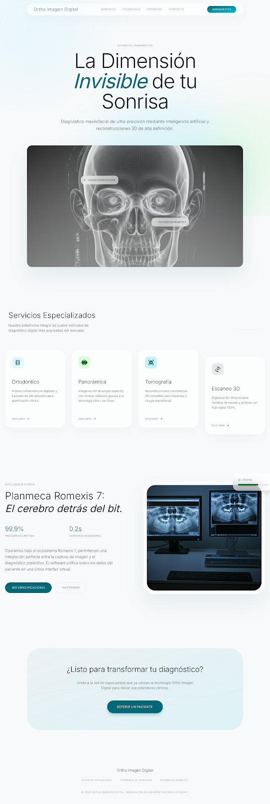
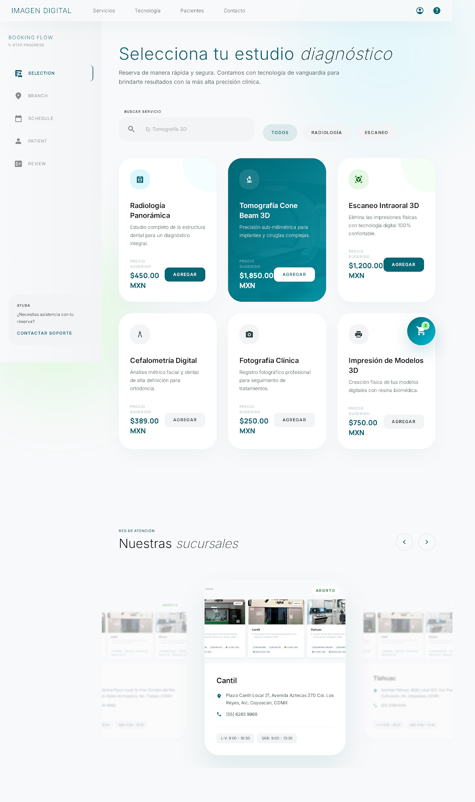
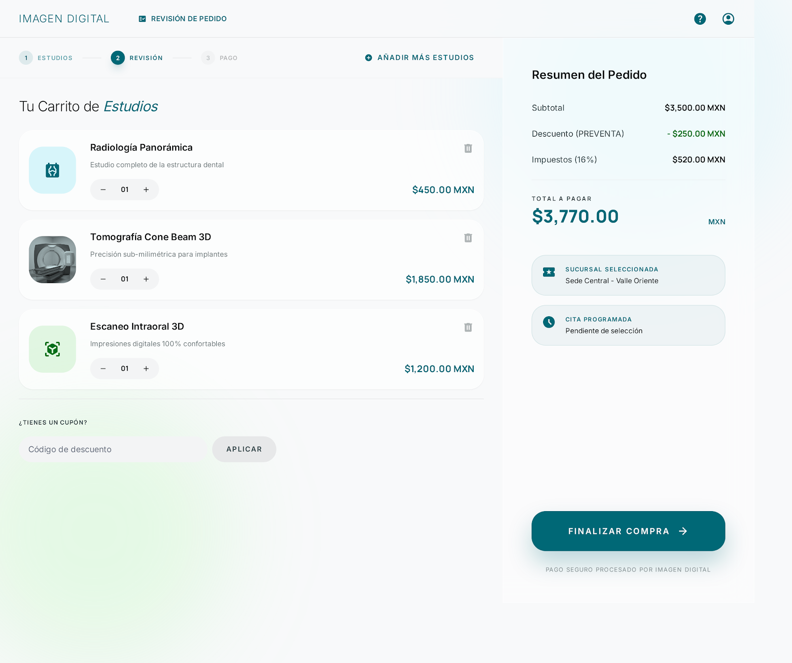
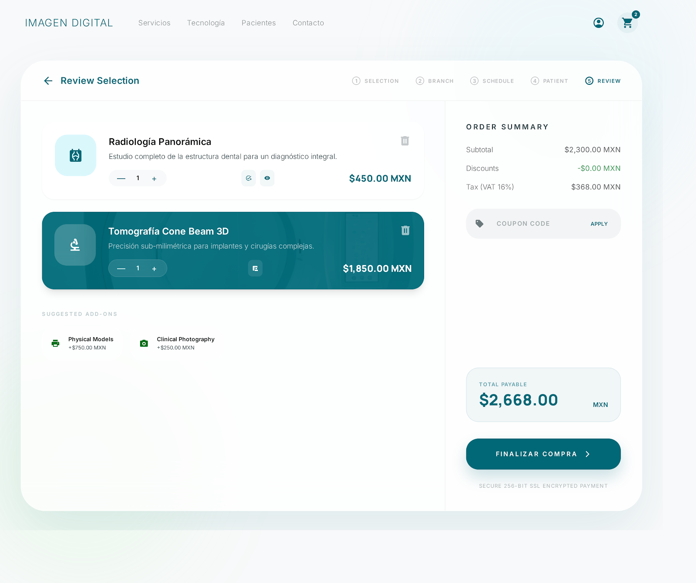

# OrthoImagenDigital - Reservation Hub v2.0
> **Ethereal Clinical UI/UX Experience**


## 💎 La Visión
**OrthoImagenDigital** redefine la experiencia de reserva médica. Basado en el concepto **"Ethereal Clinical"**, este Journey de 4 pasos elimina la fricción administrativa, transformando la selección de estudios en una experiencia fluida, inmersiva y de alta fidelidad.

---

## 🚀 Características Clave

### 1. Journey de 4 Pasos (Fluid-Flow)
Diseñado para guiar al paciente sin abrumarlo:
- **Paso 1: Selección de Estudios**: Catálogo dinámico de alta densidad con feedback visual instantáneo.
- **Paso 2: Selección de Sucursal**: Galería panorámica con las 5 sedes estratégicas.
- **Paso 3: Agenda Inteligente**: Selección táctil de fecha y hora en tiempo real.
- **Paso 4: Registro Seguro**: Formulario clínico optimizado con validación predictiva.

### 2. Motor de Selección Premium
- **Efectos de Gradiente**: Transiciones visuales entre estados de selección (Cian/Azul OID).
- **Sincronización Global**: El "Resumen de Orden" lateral se actualiza dinámicamente en cada interacción.
- **Arquitectura Robusta**: Lógica de eventos globalizada para máxima compatibilidad y rapidez.

---

## 📸 Galería de Interfaz

| Home & Servicios | Catálogo de Estudios |
| :---: | :---: |
|  |  |

| Selección de Sucursal | Agenda & Registro |
| :---: | :---: |
|  |  |

---

## 🛠️ Stack Tecnológico
- **Frontend**: HTML5, Vanilla CSS3, Tailwind CSS.
- **Interactividad**: GSAP (GreenSock Animation Platform).
- **Backend**: PHP 8.x.
- **Tipografía**: Inter (Google Fonts).

---

## 📦 Instalación Local

1. Clona el repositorio:
   ```bash
   git clone https://github.com/mit-asesores/oid-design-v2.git
   ```
2. Mueve la carpeta a tu servidor local (WAMP/XAMPP).
3. Accede a `http://localhost/oid-design-v2/reserva.php`.

---

© 2024 **mit-asesores** | OrthoImagenDigital. Todos los derechos reservados.
